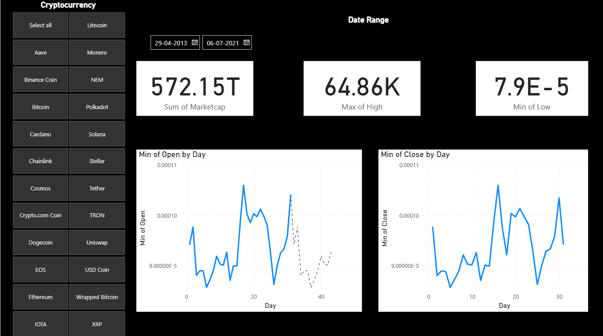

# Cryptocurrency-Dashboard-with-Power-BI

## 📊 Project Overview
This project visualizes cryptocurrency market trends using **Power BI**. The dataset covers **2013 to 2021**, providing insights into market capitalization, price fluctuations, and overall trends in the crypto world.

## 🔹 Features
✅ Select and analyze different cryptocurrencies  
✅ **"Select All" option available** to view all coins at once or filter individual coins  
✅ Apply a date filter to focus on specific time periods  
✅ View total market capitalization, highest and lowest prices  
✅ Time-series analysis for opening & closing prices  

## 📌 Data Source
The dataset consists of historical cryptocurrency prices, market capitalization, and volume data collected over several years.

## 🎯 Insights
- **Market Volatility:** The dashboard highlights fluctuations in cryptocurrency prices.
- **Trend Analysis:** Users can analyze price movements over different periods.
- **Comparative Analysis:** Compare different cryptocurrencies across time.
- **Multiple Selection:** Users can either analyze **all cryptocurrencies together** or focus on **specific individual coins**.

## 🚀 How to Use
1. Download the `.pbix` file and open it in **Power BI Desktop**.
2. Use the **cryptocurrency selection panel** to choose either:
   - "Select All" to view all coins.
   - Click individual coins to analyze specific ones.
3. Adjust the **date range filter** to focus on a specific time period.
4. Gain insights from the interactive visualizations.

## 📷 Dashboard Preview

## 🔗 Connect with Me
Feel free to connect and discuss this project!  
💼 LinkedIn: https://www.linkedin.com/in/saurav-sevda-2288a4244/
